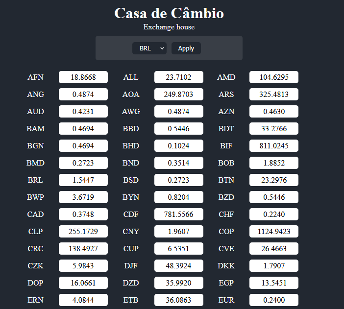

## Conversor de Moedas - Casa de Câmbio Digital
---
Interface:

</img>

---
# Sobre o Projeto
Aplicativo de casa de câmbio digital que permite converter valores entre diversas moedas internacionais utilizando as cotações atualizadas diariamente.

## Funcionalidades Principais
- Conversão de moedas com cotações atualizadas automaticamente às 00:00:01 UTC
- Seleção entre +160 moedas diferentes    
- Atualização em tempo real ao mudar a moeda base

## Principais Tópicos Aplicados
- JavaScript Assíncrono
- Requisições HTTP à API de cotações (<a href="https://app.exchangerate-api.com/dashboard">ExchangeRate-API</a>)
- Manipulação do DOM para atualização dinâmica da interface
- Armazenamento temporário com sessionStorage para otimização de requisições

---
# Como Executar o Projeto
1. Clone o repositório:

```bash
git clone https://github.com/mateusgalv/JS-Async-vite--ExchangeRate
```

2. Navegue até a pasta do projeto:

```bash
cd JS-Async-vite--ExchangeRate
```

3. Instale as dependências:

```bash
npm install
```

4. Inicie o servidor:

```bash
npm start
```

O aplicativo estará disponível em: http://localhost:5173

---
# Estrutura do Projeto

JS-Async-vite--ExchangeRate/  
├── src/  
│&nbsp;&nbsp;&nbsp;&nbsp;&nbsp;&nbsp;├── img/  
|&nbsp;&nbsp;&nbsp;&nbsp;&nbsp;&nbsp;│&nbsp;&nbsp;&nbsp;&nbsp;&nbsp;&nbsp;└── image.png  
│&nbsp;&nbsp;&nbsp;&nbsp;&nbsp;&nbsp;├── styles/  
│&nbsp;&nbsp;&nbsp;&nbsp;&nbsp;&nbsp;│&nbsp;&nbsp;&nbsp;&nbsp;&nbsp;&nbsp;└── style.css  
│&nbsp;&nbsp;&nbsp;&nbsp;&nbsp;&nbsp;├── utils/  
│&nbsp;&nbsp;&nbsp;&nbsp;&nbsp;&nbsp;│&nbsp;&nbsp;&nbsp;&nbsp;&nbsp;&nbsp;└── rates.js  
│&nbsp;&nbsp;&nbsp;&nbsp;&nbsp;&nbsp;└── index.html  
├── package.json  
├── package-lock.json  
└── README.md  

---
# Contatos
    GitHub: github.com/mateusgalv
    LinkedIn: linkedin.com/in/mateus-galvao
    E-mail: mateustgalvao@gmail.com